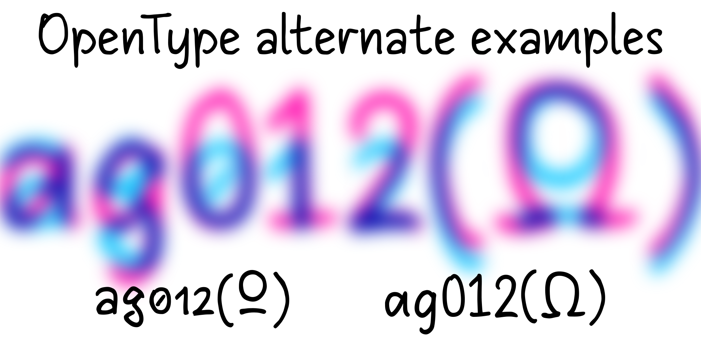
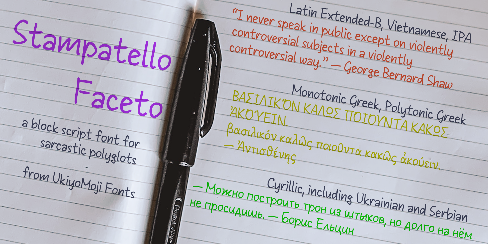

# Stampatello Faceto

Stampatello Faceto is an insanely multilingual handwriting font that supports a wide array of Latin, Greek, and Cyrillic characters.

## About

UkiyoMoji Fonts is a label under which I (Haley Wakamatsu) release fonts, most of them available for free.

## Building

Since this repository template does not support FontForge, fonts are built manually.

## Changelog

**05 Dec 2023. Version 0.02**
- MINOR Added some kerning.
- MINOR Added certain Latin letters: capital schwa, capital turned E, capital ezh.
- MINOR Added certain Cyrillic letters: capital and lowercase barred O, Cyrillic equivalents of the Latin additions, and lots of letters plus one diacritic.

**10 Nov 2023. Version 0.01**
- MAJOR Initial upload.

## License

This Font Software is licensed under the SIL Open Font License, Version 1.1.
This license is available with a FAQ at
https://scripts.sil.org/OFL

## Repository Layout

This font repository structure is inspired by [Unified Font Repository v0.3](https://github.com/unified-font-repository/Unified-Font-Repository), modified for the Google Fonts workflow.
